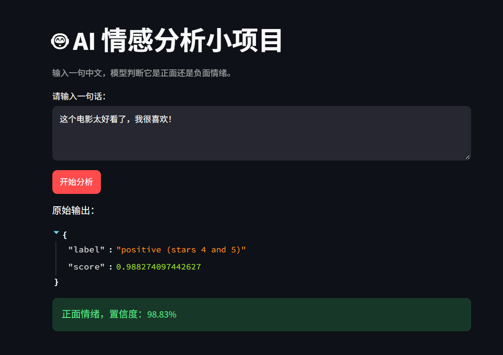
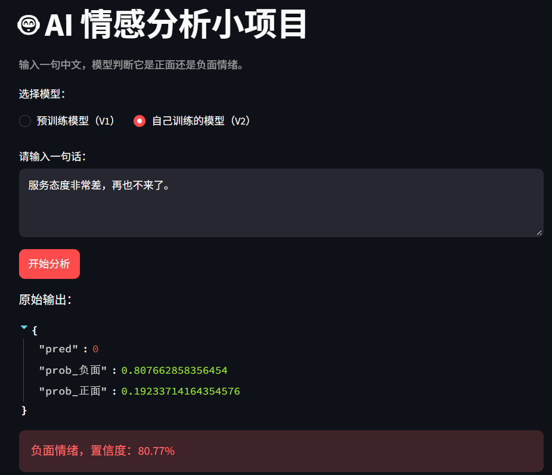

# AI 中文情感分析

## 功能

输入一句中文，模型判断它是正面还是负面情绪，并给出置信度。

支持两个模型：
- **预训练模型（V1）**：基于 Hugging Face 的 RoBERTa，工业级精度。
- **自己训练的模型（V2）**：基于 TF-IDF + 朴素贝叶斯，用 100 条自建数据训练，用于学习原理。

## 技术栈

- Python
- Hugging Face Transformers（V1）
- scikit-learn（V2）
- jieba（V2 中文分词）
- Streamlit

## 模型

- V1：`uer/roberta-base-finetuned-jd-binary-chinese`
- V2：TF-IDF + MultinomialNB，训练于 `data/reviews.csv`（100 条中文评论）

## 项目结构

```text
ai-sentiment/
├── app.py                    # Streamlit 主程序
├── train.py                  # V2 训练脚本
├── debug.py                  # 查看模型学到的词
├── requirements.txt          # 依赖清单
├── README.md                 # 项目说明
├── data/
│   └── reviews.csv           # V2 训练数据
├── models/
│   └── sentiment_sklearn.joblib  # V2 训练好的模型
└── scratch/                  # 探索脚本
```

## 运行方式
- pip install -r requirements.txt
- python train.py        # 可选：重新训练 V2 模型
- streamlit run app.py

## 注意事项

- 终端必须激活虚拟环境（.venv）。
- sentencepiece 在 Windows 上需锁 0.1.99，但云端不需要（已在 requirements.txt 中移除）。
- V2 模型文件 `models/sentiment_sklearn.joblib` 需先运行 `python train.py` 生成。

## 在线体验

https://ai-sentiment-fxy.streamlit.app

## 界面预览

### V1 + V2 双模型



### 自己训练的模型

